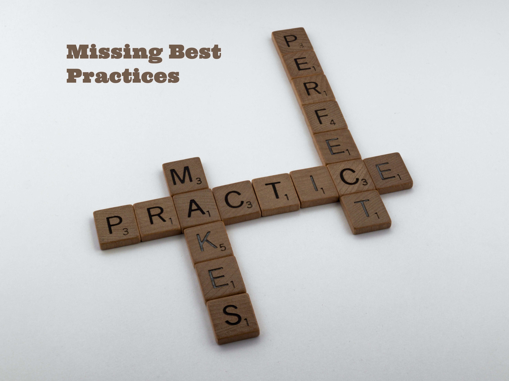

# Missing Best Practices

Missing Best Practices in Flutter App Dev and Design. Note, that I simulate a GitHub fork through use of number project folders. 

The benefit is you can see how things fit together as far as getting to the final result of all the Flutter Best Practices implemented in a small enough app that you can replicate for any size flutter app you are developing.

## Best Practices Included

## The Articles

The articles about all the methods can be found at my Medium blog:

[Fred Grott's Medium Blog](https://fredgrott.medium.com)

